# Vita — o agente que estanca o dreno do rotativo antes de ele virar dívida

Batalha de Agentes (Itaú × Google Cloud), 26–27/09/2026. Agente conversacional em Google ADK sobre
GCP que detecta, no extrato do cliente, o custo dos juros do rotativo do cartão, mostra em reais
quanto isso custou e oferece só os tratamentos que cabem no orçamento, sempre com confirmação do
cliente. **Todo número vem de uma tool determinística; o modelo nunca calcula, decide nem executa.**

## Entregáveis obrigatórios

| # | Entregável | Onde está | Status |
| --- | --- | --- | --- |
| 1 | **Proposta de negócio** (jornada, dor, proposta de valor, impacto) | [`docs/entregaveis/1. Proposta de negócio.pdf`](docs/entregaveis/1.%20Proposta%20de%20neg%C3%B3cio.pdf); base em [`docs/produto/PRD.md`](docs/produto/PRD.md) | Entregue |
| 2 | **Protótipo funcional** (clicável, avaliado em Design & Experiência) | **https://vita-app-996610300787.us-central1.run.app** — público, sem login; [roteiro abaixo](#como-navegar-no-protótipo-entregável-2) | No ar |
| 3 | **Racional de prototipação** (elementos, decisões de experiência, critérios) | [`docs/entregaveis/3. Racional de prototipação.md`](docs/entregaveis/3.%20Racional%20de%20prototipa%C3%A7%C3%A3o.md) | Entregue |
| 4 | **Desenho de solução** (arquitetura, engenharia e ciência de dados) | [`docs/entregaveis/4. Desenho de solução (arquitetura).drawio`](docs/entregaveis/4.%20Desenho%20de%20solu%C3%A7%C3%A3o%20%28arquitetura%29.drawio) (abrir em diagrams.net) e a mesma imagem em [`.svg`](docs/entregaveis/4.%20Desenho%20de%20solu%C3%A7%C3%A3o%20%28arquitetura%29.svg) | Entregue |
| 5 | **Documento explicativo da arquitetura** (componentes, integrações, decisões, justificativas) | [`docs/entregaveis/5. Documento explicativo da arquitetura.md`](docs/entregaveis/5.%20Documento%20explicativo%20da%20arquitetura.md) (mesmo conteúdo de [`docs/ARCHITECTURE.md`](docs/ARCHITECTURE.md)) | Entregue |

<p align="center">
  <a href="https://vita-app-996610300787.us-central1.run.app"></a><br>
  <sub>Aponte a câmera do celular: abre o protótipo no ar.</sub>
</p>

### Como navegar no protótipo (entregável 2)

1. Abra a URL: a tela de bloqueio mostra o push do Vita. Toque em **Abrir no Vita**.
2. O chat abre com a mensagem de abertura do agente, o **Raio-X da fatura** (fatura, pago, saldo no
   rotativo, juros, reserva, índice) e os **tratamentos** calculados por regra: usar a reserva e
   parcelar.
3. Toque em um tratamento, leia o comparativo e confirme com um **iToken de 6 dígitos** (na demo,
   qualquer combinação exceto `000000`). Depois, o Vita pede consentimento para lembrar.
4. Os chips acima do campo de texto disparam perguntas ao agente; "Posso ficar no rotativo por
   mais de um mês?" traz a resposta do especialista com a norma citada e o link oficial.
5. **Falar com uma pessoa** (ícone no cabeçalho) abre o encaminhamento com protocolo.
6. Cena do cliente sem oferta de crédito (faixa V): **https://vita-app-996610300787.us-central1.run.app/?cliente=marcos**

A URL é a forma determinística do serviço `vita-app` no Cloud Run (nome do serviço + número do
projeto): não muda entre versões e permanece pública. A forma com hash
(`vita-app-277ilp3dyq-uc.a.run.app`) aponta para o mesmo serviço.

### As jornadas em imagens

Capturas do protótipo em viewport de celular (390 px). Todos os valores vêm das tools do agente
sobre a base sintética do evento; nenhum foi escrito na tela.

**Jornada do Bruno: do push à confirmação**

| Push na tela bloqueada | Abertura do agente e ações | Raio-X da fatura |
| --- | --- | --- |
| 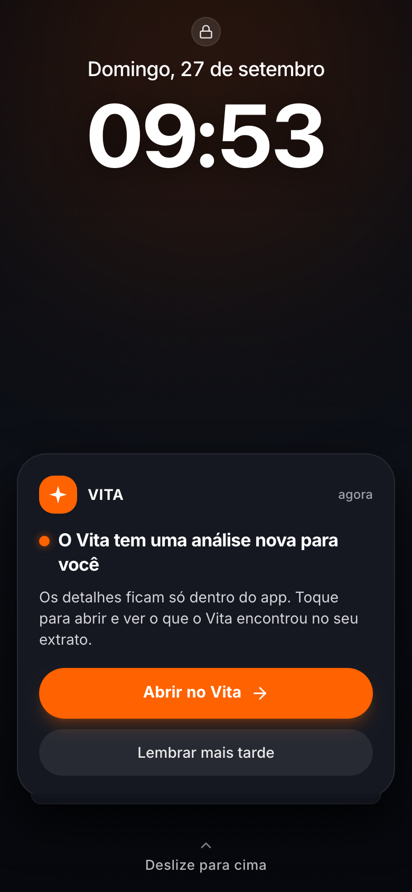 | 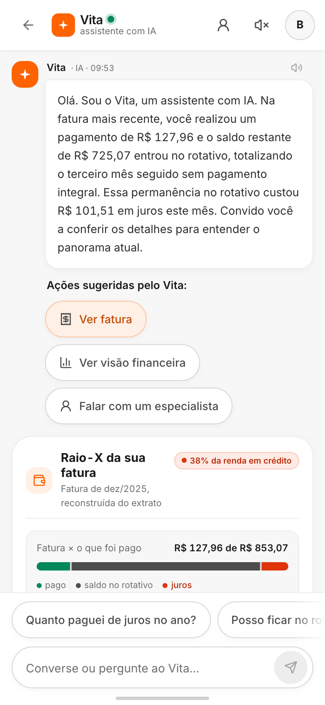 | 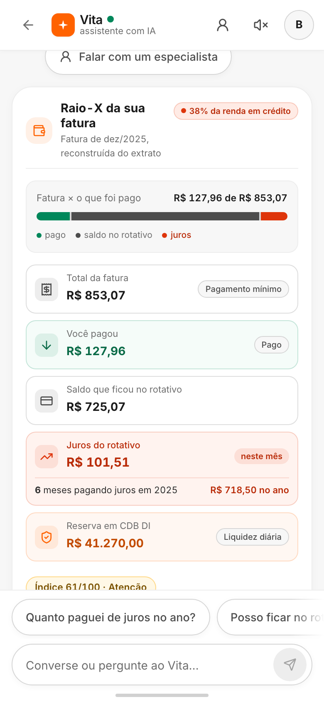 |

| Tratamentos por regra | Fatura completa, mês a mês | Visão financeira e índice |
| --- | --- | --- |
| 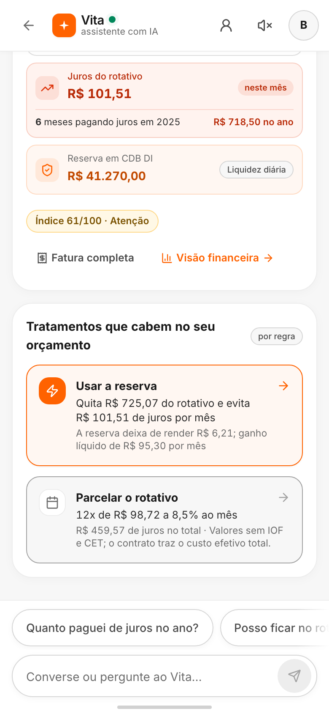 | 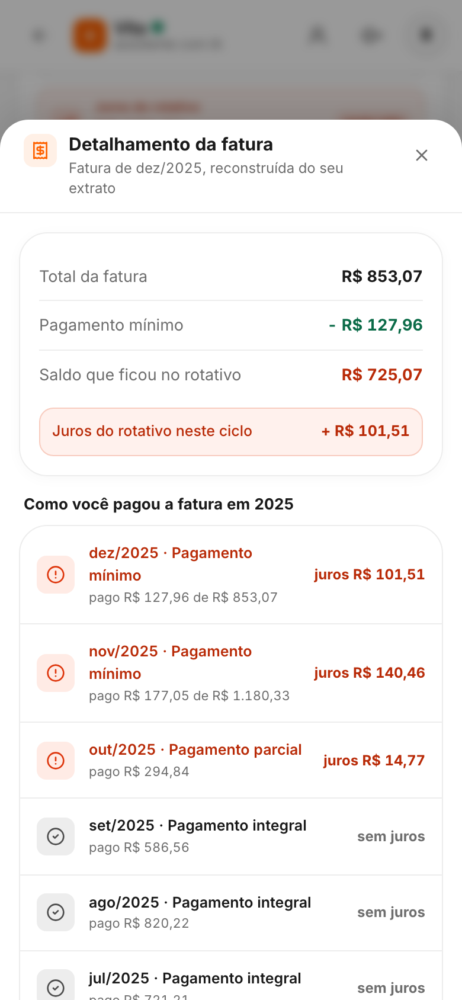 | 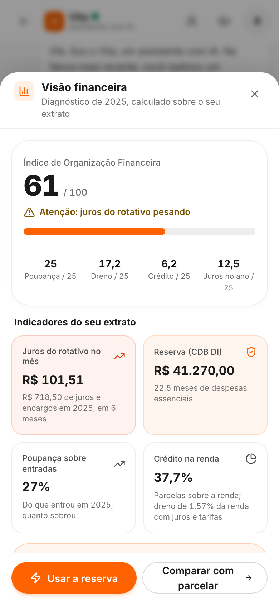 |

| T02: parcelar, só o que cabe na regra | T01: usar a reserva, com iToken | Confirmado: hero e comparativo |
| --- | --- | --- |
| 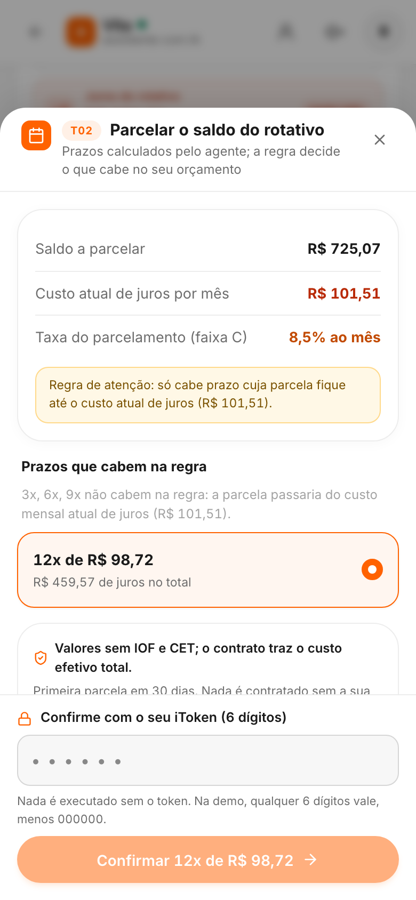 | 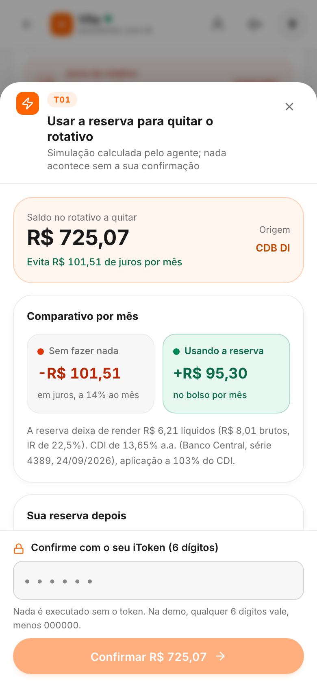 |  |

**Memória, normas e pessoa**

| Consentimento para lembrar | O que o Vita lembra (e apagar) | Pergunta normativa com fonte citada |
| --- | --- | --- |
| 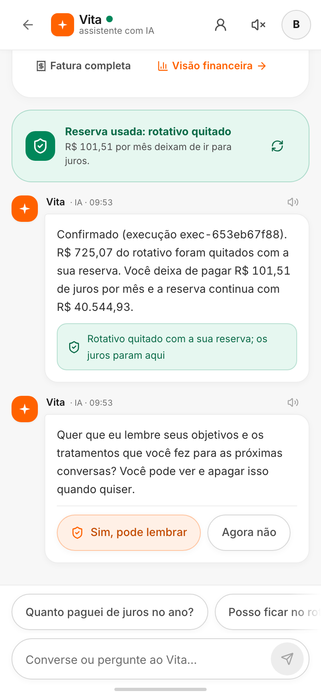 | 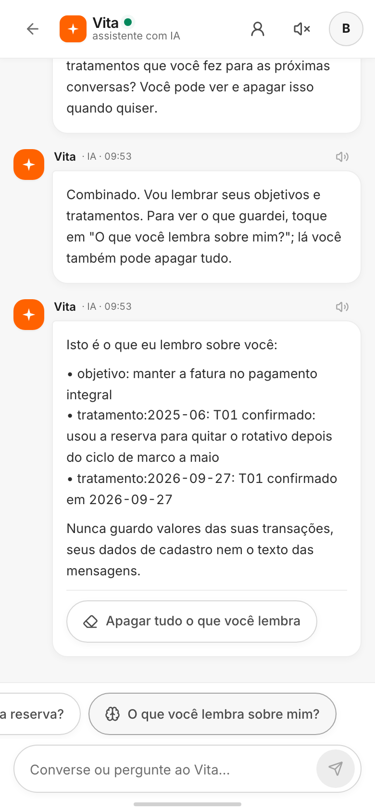 | 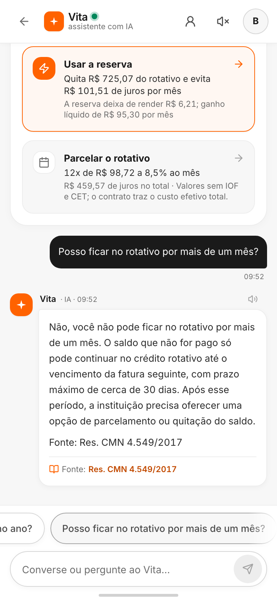 |

| Falar com uma pessoa | Protocolo aberto | Cena do Marcos: faixa V sem oferta |
| --- | --- | --- |
|  | 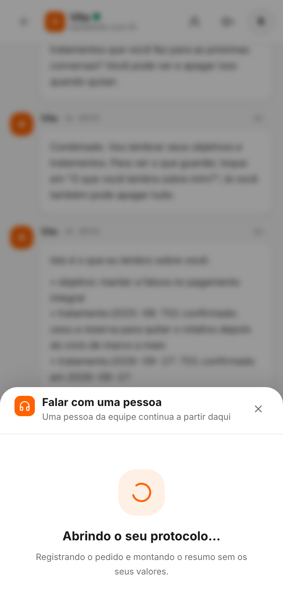 | 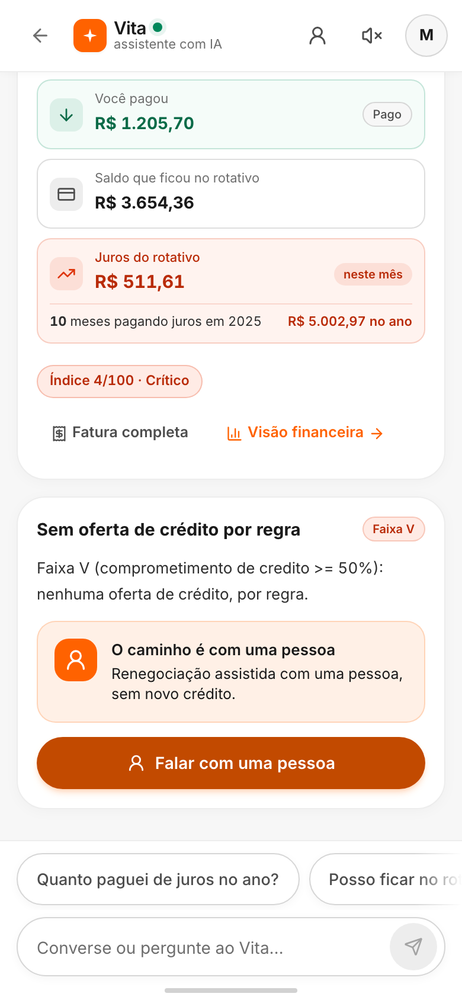 |

O que cada tela faz — push, Raio-X, tratamentos, confirmação, faixa V, conversa e estados de erro — está em [`docs/design/DESIGN_SPEC.md`](docs/design/DESIGN_SPEC.md). O porquê das decisões de experiência (conceito visual, jornada, acessibilidade e limites do protótipo) está em [`docs/design/RACIONAL_PROTOTIPACAO.md`](docs/design/RACIONAL_PROTOTIPACAO.md). O processo de prototipação está no [board Vita UI no Figma](https://www.figma.com/board/Q7AT7ixAWbHOCdK62QAQYq/Vita-UI---prototipa%C3%A7%C3%A3o?node-id=0-1&t=IWzzhY5ypC7wMkV8-1). O entregável 3 oficial continua em [`docs/entregaveis/3. Racional de prototipação.md`](docs/entregaveis/3.%20Racional%20de%20prototipa%C3%A7%C3%A3o.md).

---

## O problema

Na base sintética do evento (1.000 clientes, extrato de 2025):

| Evidência | Valor |
| --- | --- |
| Clientes que pagam juros de forma crônica (último mês e em 3+ meses do ano) | 355 |
| Juros e encargos pagos por eles no ano | R$ 365.598,84 |
| Dreno sobre a renda para quem ganha menos de R$ 3 mil, contra a faixa de R$ 6 a 10 mil | 3,55% contra 1,99% |
| Clientes com 3 faturas seguidas sem pagamento integral (público do gatilho) | 245 |
| Juros de rotativo desses 245 clientes no ano, média por cliente | R$ 102.751,19 · R$ 419,39 |

O dreno é invisível porque se mistura a dezenas de lançamentos, e pesa mais em quem ganha menos.
O banco vê o atraso quando ele já virou inadimplência; o cliente vê a fatura crescer sem saber por quê.

## A proposta

O Vita age antes de o cliente pedir ajuda. Um evento de dados, não uma campanha: quando o cliente
completa três faturas seguidas sem pagamento integral, o Vita monta o diagnóstico, manda um push
neutro (nenhum número sai da tela bloqueada) e abre a conversa já com o Raio-X e as saídas.

- **Métrica norte:** juros de rotativo evitados por cliente atendido, em reais por ano. Meta do
  piloto: R$ 200 por ano por cliente que confirma um tratamento, sem aumento do comprometimento de
  crédito.
- **Dimensionamento** (taxas são estimativas a validar no experimento): 245 elegíveis → 40% abrem
  a conversa → 50% confirmam → R$ 209,70 evitados por cliente → **R$ 10.275 por ano a cada 1.000
  clientes da base**.
- **O que o banco ganha:** abre mão de juros de rotativo, em média R$ 419 por cliente elegível por
  ano, e recomenda não contratar crédito quando esse é o melhor caminho; em troca reduz o risco de
  o rotativo virar atraso e inadimplência e fortalece a relação. Tese a validar no experimento.
- **Guardrails de bem-estar:** nenhuma oferta de crédito à faixa V; comprometimento dos atendidos
  não aumenta; reincidência no rotativo em 90 dias cai em relação ao controle. Engajamento é
  acompanhado, não é meta.

## Funcionalidades

| Funcionalidade | O que o cliente vê | Como é garantido |
| --- | --- | --- |
| **Gatilho proativo** | Push na tela bloqueada, sem número; a conversa abre já montada | Regra sobre `vw_fatura_mensal` (3 faturas sem pagamento integral); pipeline diagnóstico → redator grava a sessão; semente na imagem, zero chamada ao modelo para abrir |
| **Raio-X da fatura** | Fatura reconstruída, pago, saldo no rotativo, juros do mês e do ano, reserva | Reconstrução determinística do extrato (pago 127,96 → fatura 853,07 → juros 101,51 → saldo 725,07 para a persona Bruno) |
| **Índice de Organização Financeira** | 0 a 100, com status | 4 pilares × 25 (poupança, dreno, comprometimento, cronicidade) sobre a bioimpedância financeira |
| **T01 · usar a reserva** | Quanto quita, juros evitados, o que a reserva deixa de render, saldo depois | CDI do Banco Central (SGS, série 4389), IR regressivo, `simulacao_id` com validade |
| **T02 · parcelar a fatura** | Prazos, parcela, juros totais; só os que cabem na regra | Ofertas por faixa de risco, tabela Price, regra de atenção (parcela nunca maior que o custo mensal atual de juros) |
| **Motor de decisão** | A opção mais barata vem primeiro | Ordena por custo mensal; nunca oferece crédito à faixa V |
| **Confirmação segura** | iToken de 6 dígitos, execução registrada | Idempotência (duplo clique = uma execução), evento `tratamento_confirmado`, nada muda de estado sem confirmação |
| **Memória com consentimento** | "Quer que eu lembre?", "O que você lembra sobre mim?", apagar tudo | Só grava com "sim"; só chaves permitidas (objetivo, tratamento); nunca valores, cadastro ou texto; acesso e eliminação sem passar pelo modelo |
| **Especialista em normas** | Resposta com "Fonte:" e link (Res. CMN 4.549/2017, Lei 14.690/2023, superendividamento, CET, IOF, IR) | Corpus curado (8 fontes, 24 trechos) com busca BM25 local; resposta normativa sem citação é bloqueada |
| **Falar com uma pessoa** | Protocolo e fila; resumo só com consentimento | Resumo leva faixa, mês, gatilho e recomendação; nunca valor, nome ou identificador |
| **Cena da faixa V** | Custo explicado, nenhuma oferta, caminho humano | `before_tool_callback` barra a tool de crédito; o front não desenha card de oferta |
| **Acessibilidade** | Leitura em voz alta, contraste, alvos de 44 px, regiões vivas, sem depender só de cor | Meta WCAG 2.1 AA registrada; "cabe na regra" e "não cabe" em texto e ícone |

## Arquitetura em uma olhada

```
push ──▶ tela de bloqueio ──▶ chat (web/, React + Express no Cloud Run "vita-app")
                                  │  /api/*  (proxy; nenhuma chave de modelo no front)
                                  ▼
                     agente ADK 2.8 (Cloud Run "batalha-agentes", privado, ID token da SA)
          orquestrador ─┬─ analyst (tools de fatura, risco, T01, T02, ofertas)
                        ├─ educator (educação financeira)
                        └─ especialista_normas (AgentTool, modelo próprio, BM25 local)
          plugins transversais: SecurityPlugin (todas as camadas) · AuditPlugin (logs sem conteúdo)
                                  │
              Gemini no Vertex AI (squad-agent-sa) · snapshot do BigQuery do evento · SQLite (memória)
```

- **Google ADK 2.8** com `App` + plugins: os guardrails valem para todo agente, inclusive os criados
  depois; `require_confirmation` nas ações; compactação de contexto.
- **Cloud Run** com revisões por tag para cada fatia e promoção de tráfego só depois do smoke;
  **Vertex AI (Gemini)** pela service account do squad, sem chave; **BigQuery** do evento exportado
  como snapshot na imagem; **Cloud Logging** com a trilha `event=guard`.
- Papéis em modelos diferentes (orquestrador, especialista, redator) e `LLM_MODE=simulado` para
  ensaiar sem gastar cota.

## Tools (o que o modelo pode chamar)

Nenhuma tool recebe `customer_id`: a identidade vem do estado da sessão. Nenhuma devolve CPF ou
nome completo. Todo valor em reais que o modelo cita tem de existir no resultado de uma tool.

| Tool | Devolve |
| --- | --- |
| `get_fatura_rotativo` | fatura mês a mês reconstruída (modo, pago, juros, saldo) |
| `get_perfil_risco` | faixa A/B/C/V, comprometimento, motivo |
| `get_diagnostico` | indicadores da bioimpedância financeira e o índice |
| `get_posicao_investimentos` | reserva, liquidez, % do CDI |
| `simular_uso_reserva` | T01: saldo quitado, juros evitados, rendimento perdido líquido, reserva restante |
| `get_ofertas_elegiveis` | política por faixa: ofertas, taxa, prazos, regra de atenção; vazio com motivo para a faixa V |
| `simular_parcelamento_fatura` | T02: prazos com parcela, juros totais e "cabe na regra" |
| `buscar_normas` | trechos de normas com fonte, artigo, link e data de coleta |
| `give_consent` · `remember_preference` · `recall_profile` · `forget_me` | memória de longo prazo com consentimento |
| `search_knowledge` | conceitos de educação financeira |

## Guardrails (12 controles em 7 camadas, quase todos sem LLM)

| Camada | Controle |
| --- | --- |
| Entrada | Normalização (NFKC, invisíveis, desofuscação de leet e letras espaçadas, teto de tamanho) |
| Entrada | Dados sensíveis mascarados antes do modelo e dos logs (CPF com dígito verificador, cartão com Luhn, e-mail, telefone) |
| Entrada | Injeção e jailbreak por heurísticas em PT-BR; identificador de outro cliente na conversa; escopo; cuidado (risco à vida) com protocolo fixo |
| Modelo | Filtros de conteúdo do Gemini explícitos; token canário no prompt; payload das tools e trechos do RAG tratados como dados |
| Tools | Faixa V não chega na tool de crédito; argumentos com identificador ou CPF recusados; `customer_id` só da sessão |
| Saída | Validador de números (cifra fora do payload não sai), termos proibidos ("garantido", "aprovado", "sem risco"), canário vazado, URL fora de gov.br, citação obrigatória em resposta normativa; uma regeneração, depois resposta segura; teto de chamadas por turno |
| Ação | Nada executa sem confirmação, iToken e chave de idempotência |
| Auditoria | `event=guard` com camada, categoria, decisão e hash da entrada; nunca o texto |

**Red team medido** (`make redteam`, sem chamar o modelo): 131 casos em 13 categorias, incluindo
injeção direta e indireta, jailbreak por personagem, dados de outro cliente, oferta forçada à
faixa V, número inventado, dado sensível, ofuscação e identidade; **todas as metas atingidas,
0% de falso positivo** nas 40 perguntas legítimas. Relatório em [`docs/redteam/RELATORIO.md`](docs/redteam/RELATORIO.md).

## Segurança, LGPD e IA Responsável

- **Minimização:** projeção num ponto só (`datasources/projections.py`) descarta CPF e nome antes de
  qualquer dado sair da camada de dados; categorias sensíveis (saúde, religião, política, sindicato)
  são agregadas em "outros" no payload.
- **Consentimento é porta:** sem "sim" explícito nada é lembrado; acesso e eliminação são botões
  que não passam pelo modelo; TTL na memória.
- **Logs sem conteúdo:** latência, tokens, tool chamada e o rastro `guard`; nunca a mensagem.
- **Menor privilégio:** agente privado no Cloud Run, chamado pelo front com o ID token da service
  account; Gemini pela SA, sem chave no código; só dados sintéticos.
- **IA Responsável:** system card, política de conteúdo e ciclo purple em [`docs/rai/`](docs/rai/);
  o Vita se apresenta como IA e oferece uma pessoa a um toque.
- Detalhe em [`docs/SECURITY_LGPD.md`](docs/SECURITY_LGPD.md).

## Qualidade medida

| O que | Resultado (27/09) |
| --- | --- |
| Testes automatizados, sem credencial | 361 |
| Avaliação offline, 28 conversas sintéticas ([`docs/produto/avaliacao.md`](docs/produto/avaliacao.md)) | 13/13 números no payload · 3/3 sem oferta à faixa V · 3/3 citações · 3/3 sem inferência sensível · juiz: tom 4,1 e clareza 3,8 (1 a 5) |
| Contrafactual (mesma pergunta como Ana, João e Maria) | mesmas decisões das tools, tom equivalente |
| Latência por turno de chat | mediana 13 s, p90 28 s; abertura e telas sem chamada ao modelo, abaixo de 1 s |
| Roteiro ponta a ponta da demo (`make roteiro`) | 14/14 passos, 19,5 s com a instância quente |

Estratégia de experimentação (90/10 por revisão do Cloud Run, métricas e critérios de promoção e
rollback) em [`docs/EXPERIMENTATION.md`](docs/EXPERIMENTATION.md).

## Para rodar

```bash
make setup                 # venv 3.12 + dependências + .env
make test                  # 361 testes, sem credencial
make redteam               # red team sem modelo; grava docs/redteam/RELATORIO.md
make deploy PROJECT_ID=x   # agente no Cloud Run (TAG=fatia-sN publica sem tráfego)
make deploy-web PROJECT_ID=x AGENT_URL=y   # front (vita-app)
make roteiro BASE_URL=<vita-app>           # roteiro da demo com latência por passo
```

Convenções e invariantes para quem for alterar o código: [`CLAUDE.md`](CLAUDE.md). Mapa da
documentação: [`docs/README.md`](docs/README.md). O que cada fatia entregou:
[`docs/produto/fatias_verticais.md`](docs/produto/fatias_verticais.md).
